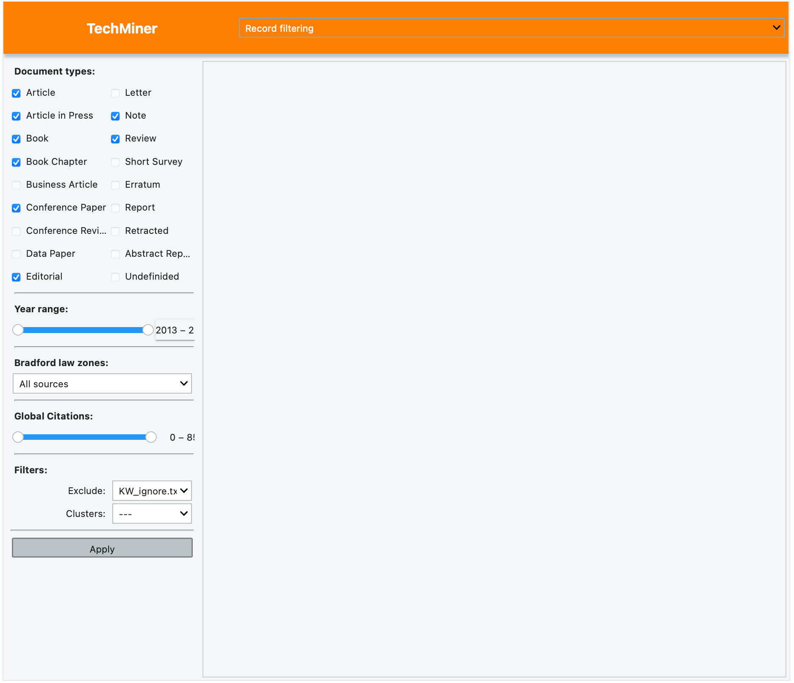

Record Filtering
===============================================================================

This app manages several filters used by all the apps in the library. 
Documents can be filtered by the type of document, year of publishing, 
number of citations, ranking of the source using the Bradford's law.
In addition, when clusters are obtained by other app, this app is able
to filter by an specified cluster. 

This app can be executed using:

.. code:: python
    
    import techminer as tech

    tech.gui.record_filtering.App().run()

