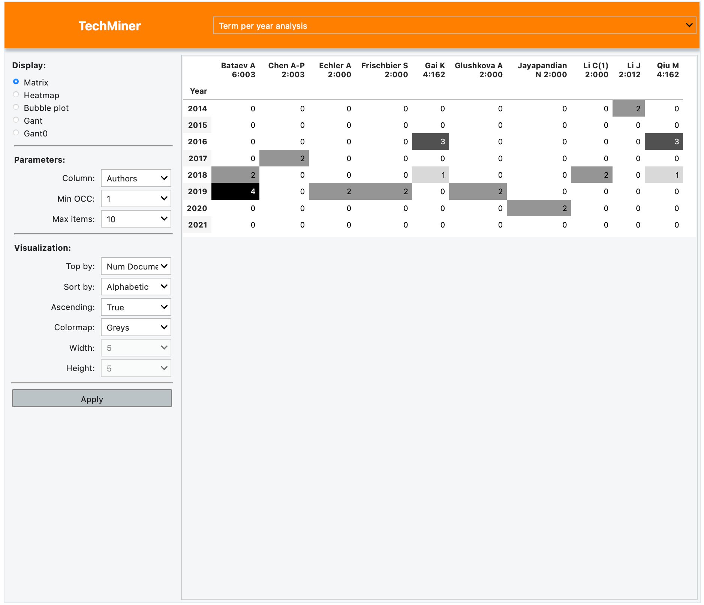

Term per year Analysis
===============================================================================

This app is used to analyze the number of documents by term per year. Columns
can be ordered by different criteria includen alphabetic, number of documents and
number of citations. *Min OCC* is the minimum occurrency value for selected terms. *Max items* is the 
maximum number of items reported in the app.

